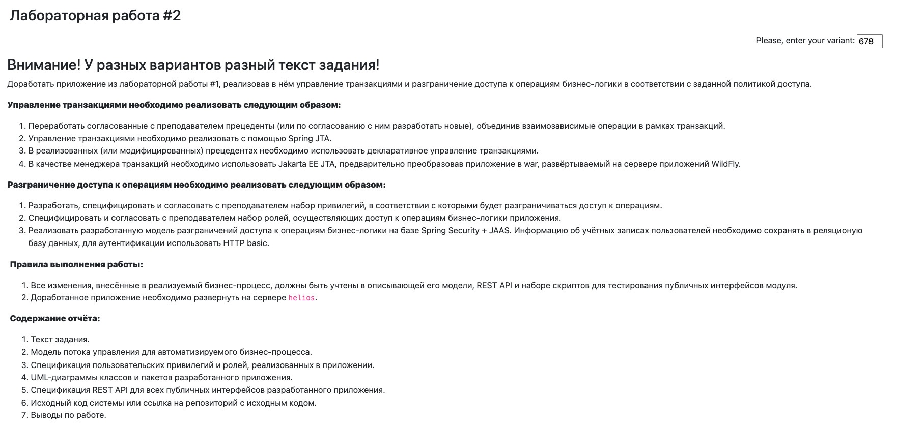

## Бизнес логика программных систем
### Лабораторная работа №2

Доработать приложение из лабораторной работы #1, реализовав в нём управление транзакциями и разграничение доступа к операциям бизнес-логики в соответствии с заданной политикой доступа.

**Управление транзакциями необходимо реализовать следующим образом:**
- Переработать согласованные с преподавателем прецеденты (или по согласованию с ним разработать новые), объединив взаимозависимые операции в рамках транзакций.
- Управление транзакциями необходимо реализовать с помощью Spring JTA.
- В реализованных (или модифицированных) прецедентах необходимо использовать декларативное управление транзакциями.
- В качестве менеджера транзакций необходимо использовать Jakarta EE JTA, предварительно преобразовав приложение в war, развёртываемый на сервере приложений WildFly.
- Разграничение доступа к операциям необходимо реализовать следующим образом:

**Разработать, специфицировать и согласовать с преподавателем набор привилегий, в соответствии с которыми будет разграничиваться доступ к операциям.**
- Специфицировать и согласовать с преподавателем набор ролей, осуществляющих доступ к операциям бизнес-логики приложения.
- Реализовать разработанную модель разграничений доступа к операциям бизнес-логики на базе Spring Security + JAAS. Информацию об учётных записах пользователей необходимо сохранять в реляционую базу данных, для аутентификации использовать HTTP basic.

**Правила выполнения работы:**
- Все изменения, внесённые в реализуемый бизнес-процесс, должны быть учтены в описывающей его модели, REST API и наборе скриптов для тестирования публичных интерфейсов модуля.
- Доработанное приложение необходимо развернуть на сервере helios.

**Содержание отчёта:**
- Текст задания.
- Модель потока управления для автоматизируемого бизнес-процесса.
- Спецификация пользовательских привилегий и ролей, реализованных в приложении.
- UML-диаграммы классов и пакетов разработанного приложения.
- Спецификация REST API для всех публичных интерфейсов разработанного приложения.
- Исходный код системы или ссылка на репозиторий с исходным кодом.
- Выводы по работе.
