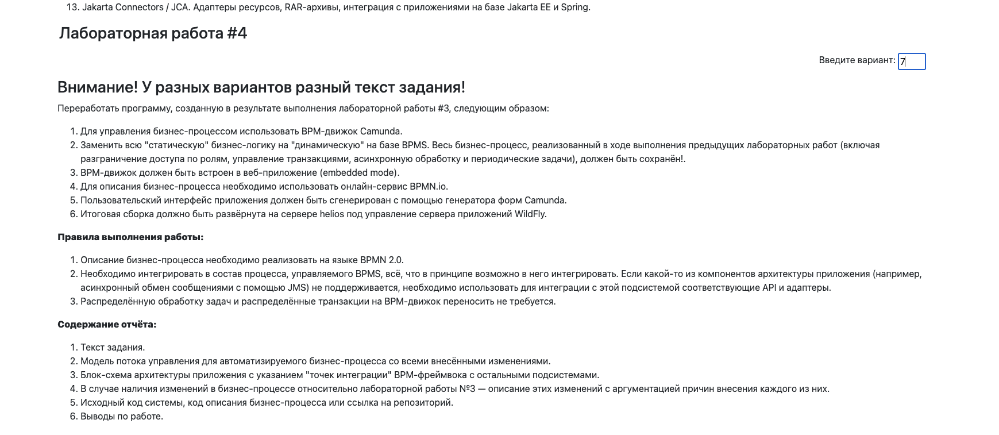

## Бизнес логика программных систем
### Лабораторная работа №4

Переработать программу, созданную в результате выполнения лабораторной работы #2, следующим образом:

1. Для управления бизнес-процессом использовать BPM-движок Camunda.
2. Заменить всю "статическую" бизнес-логику на "динамическую" на базе BPMS. Весь бизнес-процесс, реализованный в ходе выполнения предыдущих лабораторных работ (включая разграничение доступа по ролям, управление транзакциями, асинхронную обработку и периодические задачи), должен быть сохранён!.
3. BPM-движок должен быть встроен в веб-приложение (embedded mode).
4. Для описания бизнес-процесса необходимо использовать онлайн-сервис BPMN.io.
5. Пользовательский интерфейс приложения должен быть сгенерирован с помощью генератора форм Camunda.
6. Итоговая сборка должно быть развёрнута на сервере helios под управление сервера приложений WildFly.

Правила выполнения работы:
1. Описание бизнес-процесса необходимо реализовать на языке BPMN 2.0.
2. Необходимо интегрировать в состав процесса, управляемого BPMS, всё, что в принципе возможно в него интегрировать. Если какой-то из компонентов архитектуры приложения (например, асинхронный обмен сообщениями с помощью JMS) не поддерживается, необходимо использовать для интеграции с этой подсистемой соответствующие API и адаптеры.
3. Распределённую обработку задач и распределённые транзакции на BPM-движок переносить не требуется.

Содержание отчёта:
1. Текст задания.
2. Модель потока управления для автоматизируемого бизнес-процесса со всеми внесёнными изменениями.
3. Блок-схема архитектуры приложения с указанием "точек интеграции" BPM-фреймвока с остальными подсистемами.
4. В случае наличия изменений в бизнес-процессе относительно лабораторной работы №3 — описание этих изменений с аргументацией причин внесения каждого из них.
5. Исходный код системы, код описания бизнес-процесса или ссылка на репозиторий.
6. Выводы по работе.

