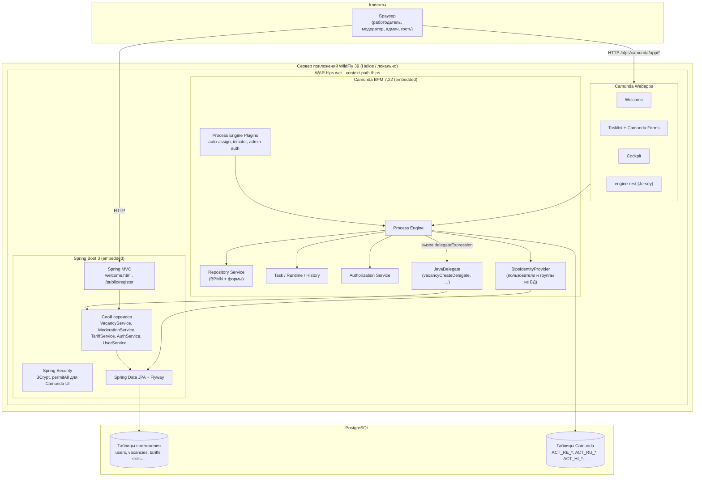
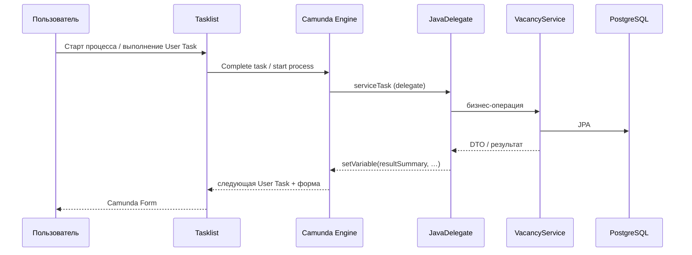

# Архитектура приложения BLPS (ЛР4)

Блок-схема развёртывания и **точки интеграции** встроенного BPM-движка Camunda 7 с остальными подсистемами.

## Схема развёртывания

## Точки интеграции BPM-фреймворка

| № | Точка | Направление | Реализация в проекте |
|---|--------|-------------|----------------------|
| **1** | **Исполняемая бизнес-логика** | BPMN → приложение | `serviceTask` с `camunda:delegateExpression="${…Delegate}"` — делегаты вызывают те же сервисы, что и REST в ЛР2–3 (`VacancyService`, `ModerationService` и т.д.) |
| **2** | **Пользовательский ввод** | UI → процесс | User Task + `camunda:formKey="camunda-forms:deployment:forms/…"` — Camunda Forms, переменные процесса |
| **3** | **Деплой моделей** | Приложение → Camunda | `BlpsCamundaDeploymentConfig` — ZIP из `bpmn/*.bpmn` и `forms/*.form` в `RepositoryService` |
| **4** | **Идентификация и роли** | БД → Camunda | `BlpsIdentityProvider` + `BlpsUserQuery` / `BlpsGroupQuery` — логин по email/паролю, группы `EMPLOYER`, `MODERATOR`, `ADMIN` |
| **5** | **Авторизация Camunda** | Конфиг → Tasklist/Cockpit | `BlpsCamundaAuthorizationConfig`, `BlpsCamundaTaskFilterConfig`, `AdministratorAuthorizationPlugin` |
| **6** | **Назначение и контекст задач** | Движок → задачи | `AutoAssignTaskListener`, `InitiatorEnrichmentListener` — assignee, `initiatorEmail`, `actorRole` |
| **7** | **Представление результатов** | Сервисы → UI | `CamundaPresentation` → переменная `resultSummary` в формах (markdown-таблицы) |
| **8** | **Персистентность** | Camunda + JPA → БД | Общий PostgreSQL: JPA/Flyway — доменная модель; Engine — свои таблицы `ACT_*` |
| **9** | **DataSource (WildFly)** | Сервер → Spring/Camunda | Профиль `wildfly`: JNDI `java:jboss/datasources/BlpsDS` в `application-wildfly.yaml` |
| **10** | **Вспомогательный HTTP** | Вне процессов | `PublicRegisterController` (`/public/register`), `welcome.html` — регистрация без Tasklist |
| **11** | **REST API движка** | Клиент/интеграции → Engine | `/blps/engine-rest` (Jersey), `BlpsCamundaJerseyConfiguration` |

## Поток данных (упрощённо)

## Размещение на Helios

| Компонент | Путь / примечание |
|-----------|------------------|
| WildFly | `~/blps/wildfly-39.0.1.Final` |
| Приложение | `standalone/deployments/blps.war` |
| Spring-профиль | **`prod`** (`-Dspring.profiles.active=prod` в `standalone.conf`) |
| HTTP | **23561** (`port-offset=15481`), туннель `ssh -L 8080:localhost:23561 ifmo` |
| БД | PostgreSQL STUDS `pg:5432/studs` (см. `application-prod.yaml`, генерируется из `deployment/helios.env`) |

Деплой: `./deployment/deploy-helios.sh` — подробнее [deployment/README-helios.md](../deployment/README-helios.md).

## Что сознательно не переносилось в BPMN

| Подсистема | Причина |
|------------|---------|
| JMS / очереди сообщений | Не использовались в варианте; Camunda 7 embedded без брокера |
| Распределённые транзакции (2PC) | По заданию ЛР4 не требуются; транзакции Spring `@Transactional` в сервисах |
| Отдельный REST для всех операций | ЛР4: UI и операции через Camunda Tasklist + формы; остался только публичный `/public/register` |

## Связанные артефакты

- Модели процессов: `src/main/resources/bpmn/*.bpmn`
- Формы: `src/main/resources/forms/*.form`
- Матрица ролей: [ROLES_SPECIFICATION.md](ROLES_SPECIFICATION.md)
- Диаграмма классов (ЛР2–3): [class-diagram.md](class-diagram.md)
