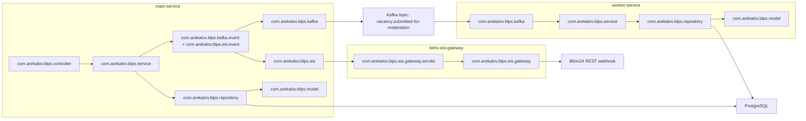

# Package And Class Diagrams

## Package Diagram

```mermaid
flowchart LR
  subgraph MAIN["main-service"]
    MAIN_CTRL["com.arekalov.blps.controller"]
    MAIN_SVC["com.arekalov.blps.service"]
    MAIN_KAFKA["com.arekalov.blps.kafka"]
    MAIN_EIS["com.arekalov.blps.eis"]
    MAIN_REPO["com.arekalov.blps.repository"]
    MAIN_MODEL["com.arekalov.blps.model"]
    MAIN_EVENT["com.arekalov.blps.kafka.event + com.arekalov.blps.eis.event"]
  end

  subgraph WORKER["worker-service"]
    W_KAFKA["com.arekalov.blps.kafka"]
    W_SVC["com.arekalov.blps.service"]
    W_REPO["com.arekalov.blps.repository"]
    W_MODEL["com.arekalov.blps.model"]
  end

  subgraph GATEWAY["bitrix-eis-gateway"]
    G_SERVLET["com.arekalov.blps.eis.gateway.servlet"]
    G_JCA["com.arekalov.blps.eis.gateway"]
  end

  B24["Bitrix24 REST webhook"]
  KAFKA["Kafka topic: vacancy.submitted-for-moderation"]
  DB["PostgreSQL"]

  MAIN_CTRL --> MAIN_SVC
  MAIN_SVC --> MAIN_REPO
  MAIN_REPO --> MAIN_MODEL
  MAIN_SVC --> MAIN_EVENT
  MAIN_EVENT --> MAIN_KAFKA
  MAIN_EVENT --> MAIN_EIS

  MAIN_KAFKA --> KAFKA
  KAFKA --> W_KAFKA
  W_KAFKA --> W_SVC
  W_SVC --> W_REPO
  W_REPO --> W_MODEL

  MAIN_EIS --> G_SERVLET
  G_SERVLET --> G_JCA
  G_JCA --> B24

  MAIN_REPO --> DB
  W_REPO --> DB
```

## Class Diagram

```mermaid
classDiagram
  %% Prefixes:
  %% Main_   main-service
  %% Worker_ worker-service
  %% Gw_     bitrix-eis-gateway
  %% Ra_     bitrix24-ra

  class Main_BlpsApplication
  class Main_ServletInitializer
  class Worker_BlpsWorkerApplication

  class Main_AuthController {
    +register(request)
  }
  class Main_VacancyController {
    +getAllVacancies(status,pageable)
    +createVacancy(auth,request)
    +publishVacancy(auth,id)
    +archiveVacancy(auth,id)
  }
  class Main_TariffController {
    +getAllTariffs(pageable)
    +createTariff(request)
  }
  class Main_ModerationController {
    +getPendingVacancies(pageable)
    +approveVacancy(auth,id)
    +rejectVacancy(auth,id,request)
  }
  class Main_TariffStatisticsController {
    +getTariffStatistics(tariffId)
    +getTariffHistory(tariffId,pageable)
  }
  class Main_UserController {
    +getCurrentUser(auth)
    +deleteUser(userId)
  }

  class Main_AuthService {
    +register(request)
  }
  class Main_VacancyService {
    +getAllVacancies(status,pageable)
    +createVacancy(userId,request)
    +publishVacancy(userId,vacancyId,role)
    +archiveVacancy(userId,vacancyId,role)
  }
  class Main_ModerationService {
    +getPendingVacancies(pageable)
    +approveVacancy(moderatorId,vacancyId)
    +rejectVacancy(moderatorId,vacancyId,reason)
  }
  class Main_TariffService {
    +getAllTariffs(pageable)
    +createTariff(request)
    +updateTariff(id,request)
  }
  class Main_TariffStatisticsService {
    +getTariffStatistics(tariffId)
    +getTariffUsageHistory(tariffId,pageable)
  }
  class Main_UserService {
    +getCurrentUser(userId)
  }
  class Main_VacancyExpirationArchivingService {
    +archiveExpiredPublishedVacancies()
  }
  class Main_VacancyArchivingScheduler {
    +archiveExpiredPublishedVacancies()
  }

  class Main_BitrixCrmService {
    +tryCreateDealForPublishedVacancy(event)
  }
  class Main_BitrixCrmOnPublishedListener {
    +onVacancyPublishedCommitted(event)
  }
  class Main_BitrixJcaEisProperties {
    +enabled
    +gatewayBaseUrl
    +crmDealAddPath
  }
  class Main_VacancyPublishedForBitrixCommitted

  class Main_KafkaProducerConfiguration
  class Main_VacancySubmittedKafkaPublisher {
    +onVacancySubmittedCommitted(event)
  }
  class Main_VacancySubmittedForModerationCommitted
  class Main_VacancySubmittedForModerationMessage

  class Worker_VacancySubmissionKafkaListener {
    +onVacancySubmitted(value)
  }
  class Worker_VacancyModerationEnqueueService {
    +acceptSubmittedPayload(json)
  }
  class Worker_VacancySubmittedForModerationMessage

  class Main_UserRepository
  class Main_VacancyRepository
  class Main_TariffRepository
  class Main_SkillRepository
  class Main_TariffUsageHistoryRepository
  class Worker_VacancyRepository

  class Main_User {
    +id
    +email
    +role
  }
  class Main_Vacancy {
    +id
    +title
    +status
    +publishedAt
  }
  class Main_Tariff {
    +id
    +name
    +price
    +durationDays
  }
  class Main_Skill {
    +id
    +name
  }
  class Main_TariffUsageHistory {
    +id
    +price
    +durationDays
    +publishedAt
  }

  class Worker_User
  class Worker_Vacancy
  class Worker_Tariff
  class Worker_Skill
  class Worker_TariffUsageHistory

  class Main_UserRole
  class Main_VacancyStatus
  class Main_ExperienceLevel
  class Main_EmploymentType
  class Main_WorkFormat
  class Main_EmploymentFormat
  class Main_WorkSchedule
  class Main_ModerationAction

  class Worker_UserRole
  class Worker_VacancyStatus
  class Worker_ExperienceLevel
  class Worker_EmploymentType
  class Worker_WorkFormat
  class Worker_EmploymentFormat
  class Worker_WorkSchedule
  class Worker_ModerationAction

  class Main_RegisterRequest
  class Main_UserResponse
  class Main_UpdateUserRequest
  class Main_CreateVacancyRequest
  class Main_UpdateVacancyRequest
  class Main_VacancyResponse
  class Main_CreateTariffRequest
  class Main_UpdateTariffRequest
  class Main_TariffResponse
  class Main_TariffStatisticsResponse
  class Main_TariffUsageHistoryResponse
  class Main_RejectVacancyRequest
  class Main_PagedResponse
  class Main_ErrorResponse

  class Main_SecurityConfig
  class Main_CustomAuthenticationEntryPoint
  class Main_CustomAccessDeniedHandler
  class Main_BlpsLoginModule
  class Main_BlpsJaasBridge
  class Main_BlpsJaasConfiguration
  class Main_RolePrincipalAuthorityGranter
  class Main_EmailPrincipal
  class Main_RolePrincipal
  class Main_UserIdPrincipal
  class Main_SalaryRange
  class Main_SalaryRangeValidator
  class Main_NotFoundException
  class Main_ValidationException
  class Main_UnauthorizedException
  class Main_ForbiddenException

  class Main_TimeConfiguration
  class Main_SchedulingConfiguration
  class Main_OpenApiConfig
  class Main_BootstrapAdminConfig
  class Main_GlobalExceptionHandler
  class Main_EnumConverterConfig
  class Main_StringToVacancyStatusConverter
  class Main_JaasConfig

  class Gw_CrmDealAddServlet {
    +doPost(req,resp)
  }
  class Gw_Bitrix24MappedRecord

  class Ra_Bitrix24ResourceAdapter
  class Ra_Bitrix24ManagedConnectionFactory
  class Ra_Bitrix24ConnectionFactoryImpl
  class Ra_Bitrix24ConnectionImpl
  class Ra_Bitrix24ManagedConnection
  class Ra_Bitrix24ManagedConnectionMetaData
  class Ra_Bitrix24ConnectionMetaData
  class Ra_Bitrix24ResourceAdapterMetaData
  class Ra_Bitrix24InteractionImpl
  class Ra_Bitrix24RecordFactory
  class Ra_Bitrix24MappedRecord
  class Ra_Bitrix24IndexedRecord
  class Ra_Bitrix24SpiLocalTransaction
  class Ra_Bitrix24CciLocalTransaction

  Main_AuthController --> Main_AuthService
  Main_VacancyController --> Main_VacancyService
  Main_TariffController --> Main_TariffService
  Main_ModerationController --> Main_ModerationService
  Main_TariffStatisticsController --> Main_TariffStatisticsService
  Main_UserController --> Main_UserService

  Main_AuthService --> Main_UserRepository
  Main_VacancyService --> Main_VacancyRepository
  Main_VacancyService --> Main_UserRepository
  Main_VacancyService --> Main_TariffRepository
  Main_VacancyService --> Main_SkillRepository
  Main_VacancyService --> Main_TariffUsageHistoryRepository
  Main_ModerationService --> Main_VacancyRepository
  Main_ModerationService --> Main_UserRepository
  Main_ModerationService --> Main_TariffUsageHistoryRepository
  Main_TariffService --> Main_TariffRepository
  Main_TariffStatisticsService --> Main_TariffRepository
  Main_TariffStatisticsService --> Main_TariffUsageHistoryRepository

  Main_VacancyService --> Main_VacancySubmittedForModerationCommitted
  Main_VacancySubmittedKafkaPublisher --> Main_VacancySubmittedForModerationCommitted
  Main_VacancySubmittedKafkaPublisher --> Main_VacancySubmittedForModerationMessage
  Worker_VacancySubmissionKafkaListener --> Worker_VacancyModerationEnqueueService
  Worker_VacancyModerationEnqueueService --> Worker_VacancyRepository
  Worker_VacancyModerationEnqueueService --> Worker_VacancySubmittedForModerationMessage

  Main_ModerationService --> Main_VacancyPublishedForBitrixCommitted
  Main_BitrixCrmOnPublishedListener --> Main_VacancyPublishedForBitrixCommitted
  Main_BitrixCrmOnPublishedListener --> Main_BitrixCrmService
  Main_BitrixCrmService --> Main_BitrixJcaEisProperties
  Main_BitrixCrmService --> Gw_CrmDealAddServlet
  Gw_CrmDealAddServlet --> Gw_Bitrix24MappedRecord
  Gw_CrmDealAddServlet --> Ra_Bitrix24ConnectionFactoryImpl
  Ra_Bitrix24ConnectionFactoryImpl --> Ra_Bitrix24ManagedConnectionFactory
  Ra_Bitrix24ManagedConnectionFactory --> Ra_Bitrix24ManagedConnection
  Ra_Bitrix24ManagedConnection --> Ra_Bitrix24InteractionImpl
  Ra_Bitrix24InteractionImpl --> Ra_Bitrix24MappedRecord
  Ra_Bitrix24InteractionImpl --> Ra_Bitrix24IndexedRecord
  Ra_Bitrix24ManagedConnection --> Ra_Bitrix24ManagedConnectionMetaData
  Ra_Bitrix24ConnectionImpl --> Ra_Bitrix24ConnectionMetaData
  Ra_Bitrix24ResourceAdapter --> Ra_Bitrix24ResourceAdapterMetaData
  Ra_Bitrix24ConnectionFactoryImpl --> Ra_Bitrix24RecordFactory

  Main_Vacancy --> Main_User
  Main_Vacancy --> Main_Tariff
  Main_Vacancy --> Main_Skill
  Main_TariffUsageHistory --> Main_Vacancy
  Main_TariffUsageHistory --> Main_Tariff
  Main_TariffUsageHistory --> Main_User
  Main_User --> Main_UserRole
  Main_Vacancy --> Main_VacancyStatus
  Main_Vacancy --> Main_ExperienceLevel
  Main_Vacancy --> Main_EmploymentType
  Main_Vacancy --> Main_WorkFormat
  Main_Vacancy --> Main_EmploymentFormat
  Main_Vacancy --> Main_WorkSchedule

  Main_GlobalExceptionHandler --> Main_ErrorResponse
  Main_GlobalExceptionHandler --> Main_NotFoundException
  Main_GlobalExceptionHandler --> Main_ValidationException
  Main_GlobalExceptionHandler --> Main_UnauthorizedException
  Main_GlobalExceptionHandler --> Main_ForbiddenException
```
