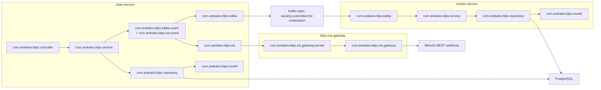

# BLPS Package and Class Diagrams

## Package Diagram

```mermaid
flowchart LR
  subgraph MAIN["main-service"]
    MAIN_CTRL["com.arekalov.blps.controller"]
    MAIN_SVC["com.arekalov.blps.service"]
    MAIN_KAFKA["com.arekalov.blps.kafka"]
    MAIN_EIS["com.arekalov.blps.eis"]
    MAIN_REPO["com.arekalov.blps.repository"]
    MAIN_MODEL["com.arekalov.blps.model"]
    MAIN_EVENT["com.arekalov.blps.kafka.event + com.arekalov.blps.eis.event"]
  end

  subgraph WORKER["worker-service"]
    W_KAFKA["com.arekalov.blps.kafka"]
    W_SVC["com.arekalov.blps.service"]
    W_REPO["com.arekalov.blps.repository"]
    W_MODEL["com.arekalov.blps.model"]
  end

  subgraph GATEWAY["bitrix-eis-gateway"]
    G_SERVLET["com.arekalov.blps.eis.gateway.servlet"]
    G_JCA["com.arekalov.blps.eis.gateway"]
  end

  B24["Bitrix24 REST webhook"]
  KAFKA["Kafka topic: vacancy.submitted-for-moderation"]
  DB["PostgreSQL"]

  MAIN_CTRL --> MAIN_SVC
  MAIN_SVC --> MAIN_REPO
  MAIN_REPO --> MAIN_MODEL
  MAIN_SVC --> MAIN_EVENT
  MAIN_EVENT --> MAIN_KAFKA
  MAIN_EVENT --> MAIN_EIS

  MAIN_KAFKA --> KAFKA
  KAFKA --> W_KAFKA
  W_KAFKA --> W_SVC
  W_SVC --> W_REPO
  W_REPO --> W_MODEL

  MAIN_EIS --> G_SERVLET
  G_SERVLET --> G_JCA
  G_JCA --> B24

  MAIN_REPO --> DB
  W_REPO --> DB
```

## Class Diagram

```mermaid
classDiagram
  class VacancyController {
    +publishVacancy(auth, id)
  }

  class ModerationController {
    +approveVacancy(auth, id)
    +rejectVacancy(auth, id, request)
  }

  class VacancyService {
    +publishVacancy(userId, vacancyId, role)
  }

  class ModerationService {
    +approveVacancy(moderatorId, vacancyId)
    +rejectVacancy(moderatorId, vacancyId, reason)
  }

  class VacancySubmittedForModerationCommitted
  class VacancyPublishedForBitrixCommitted

  class VacancySubmittedKafkaPublisher {
    +onVacancySubmittedCommitted(event)
  }

  class VacancySubmissionKafkaListener {
    +onVacancySubmitted(value)
  }

  class VacancyModerationEnqueueService {
    +acceptSubmittedPayload(json)
  }

  class BitrixCrmOnPublishedListener {
    +onVacancyPublishedCommitted(event)
  }

  class BitrixCrmService {
    +tryCreateDealForPublishedVacancy(event)
  }

  class BitrixJcaEisProperties

  class CrmDealAddServlet {
    +doPost(req, resp)
  }

  class Bitrix24MappedRecord
  class VacancyRepository
  class UserRepository
  class TariffUsageHistoryRepository
  class KafkaProducer
  class RestClient
  class ConnectionFactory

  VacancyController --> VacancyService : uses
  ModerationController --> ModerationService : uses

  VacancyService --> VacancyRepository : uses
  VacancyService --> UserRepository : uses
  VacancyService ..> VacancySubmittedForModerationCommitted : publishes

  VacancySubmittedKafkaPublisher ..> VacancySubmittedForModerationCommitted : listens AFTER_COMMIT
  VacancySubmittedKafkaPublisher --> KafkaProducer : sends message

  VacancySubmissionKafkaListener --> VacancyModerationEnqueueService : delegates
  VacancyModerationEnqueueService --> VacancyRepository : updates status

  ModerationService --> VacancyRepository : uses
  ModerationService --> UserRepository : uses
  ModerationService --> TariffUsageHistoryRepository : writes history
  ModerationService ..> VacancyPublishedForBitrixCommitted : publishes

  BitrixCrmOnPublishedListener ..> VacancyPublishedForBitrixCommitted : listens AFTER_COMMIT
  BitrixCrmOnPublishedListener --> BitrixCrmService : uses
  BitrixCrmService --> BitrixJcaEisProperties : reads config
  BitrixCrmService --> RestClient : HTTP to gateway

  CrmDealAddServlet --> ConnectionFactory : JNDI lookup Bitrix24CF
  CrmDealAddServlet --> Bitrix24MappedRecord : CCI records
```
