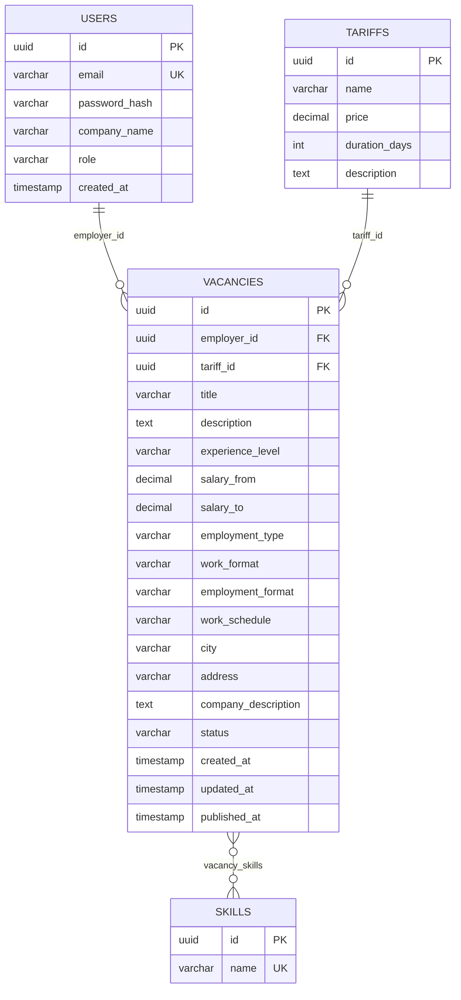

# Database Entity Relationship Diagram

## ER Diagram

```mermaid
erDiagram
    USERS ||--o{ VACANCIES : "employer_id"
    TARIFFS ||--o{ VACANCIES : "tariff_id"
    VACANCIES }o--o{ SKILLS : "vacancy_skills"

    USERS {
        uuid id PK
        varchar email UK
        varchar password_hash
        varchar company_name
        varchar role
        timestamp created_at
    }

    VACANCIES {
        uuid id PK
        uuid employer_id FK
        uuid tariff_id FK
        varchar title
        text description
        varchar experience_level
        decimal salary_from
        decimal salary_to
        varchar employment_type
        varchar work_format
        varchar employment_format
        varchar work_schedule
        varchar city
        varchar address
        text company_description
        varchar status
        timestamp created_at
        timestamp updated_at
        timestamp published_at
    }

    TARIFFS {
        uuid id PK
        varchar name
        decimal price
        int duration_days
        text description
    }

    SKILLS {
        uuid id PK
        varchar name UK
    }
```
