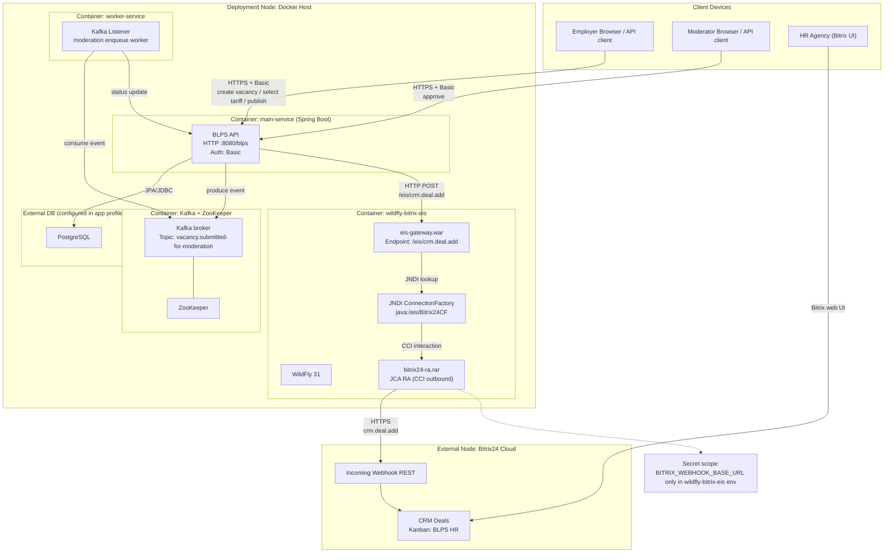

```mermaid
flowchart TB
  %% =========================
  %% Deployment nodes
  %% =========================
  subgraph ClientNode["Client Devices"]
    EMP["Employer Browser / API client"]
    MOD["Moderator Browser / API client"]
    HR["HR Agency (Bitrix UI)"]
  end

  subgraph Host["Deployment Node: Docker Host"]
    subgraph APINode["Container: main-service (Spring Boot)"]
      API["BLPS API\nHTTP :8080/blps\nAuth: Basic"]
    end

    subgraph WorkerNode["Container: worker-service"]
      WK["Kafka Listener\nmoderation enqueue worker"]
    end

    subgraph KafkaNode["Container: Kafka + ZooKeeper"]
      KFK["Kafka broker\nTopic: vacancy.submitted-for-moderation"]
      ZK["ZooKeeper"]
    end

    subgraph EISNode["Container: wildfly-bitrix-eis"]
      WF["WildFly 31"]
      WAR["eis-gateway.war\nEndpoint: /eis/crm.deal.add"]
      CF["JNDI ConnectionFactory\njava:/eis/Bitrix24CF"]
      RAR["bitrix24-ra.rar\nJCA RA (CCI outbound)"]
    end

    subgraph DataNode["External DB (configured in app profile)"]
      DB["PostgreSQL"]
    end
  end

  subgraph External["External Node: Bitrix24 Cloud"]
    BWEB["Incoming Webhook REST"]
    BCRM["CRM Deals\nKanban: BLPS HR"]
  end

  %% =========================
  %% Runtime communication
  %% =========================
  EMP -->|HTTPS + Basic\ncreate vacancy / select tariff / publish| API
  MOD -->|HTTPS + Basic\napprove| API
  API -->|JPA/JDBC| DB

  API -->|produce event| KFK
  WK -->|consume event| KFK
  WK -->|status update| API

  API -->|HTTP POST\n/eis/crm.deal.add| WAR
  WAR -->|JNDI lookup| CF
  CF -->|CCI interaction| RAR
  RAR -->|HTTPS\ncrm.deal.add| BWEB
  BWEB --> BCRM
  HR -->|Bitrix web UI| BCRM

  KFK --- ZK

  %% =========================
  %% Notes
  %% =========================
  N1["Secret scope:\nBITRIX_WEBHOOK_BASE_URL only in wildfly-bitrix-eis env"]

  RAR -.-> N1

```