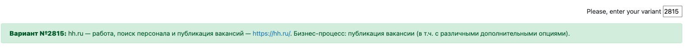
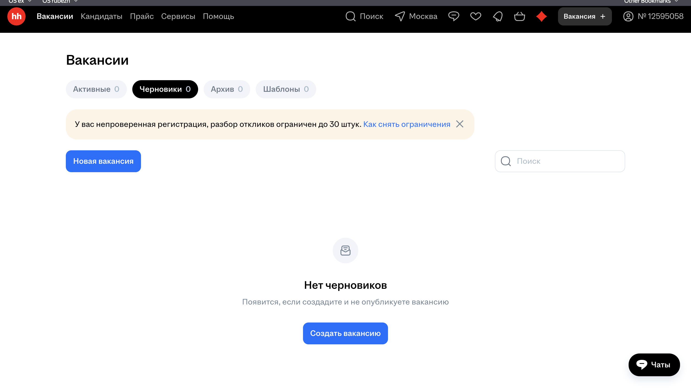
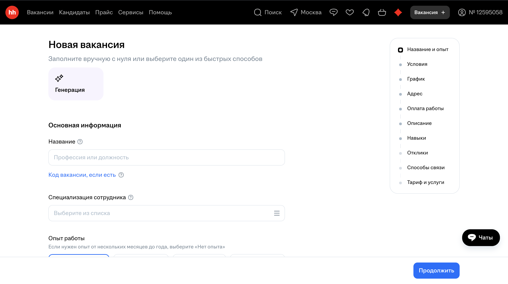
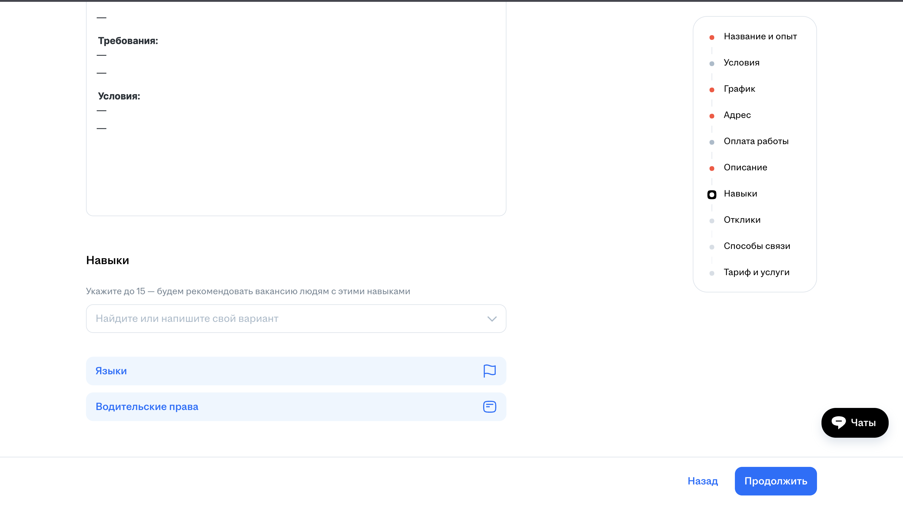
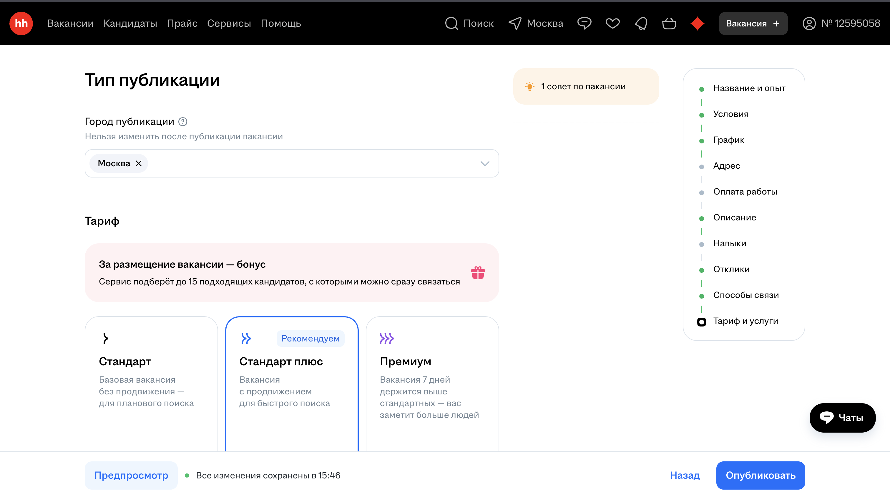
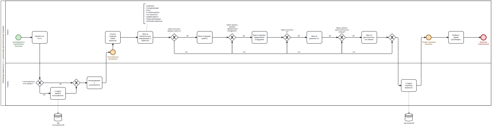

## Бизнес логика программных систем
### ЛР 1
Рекалов Арём Олегович, поток 1.4, группа P3309

Вариант 2815

---

## 1. Текст задания

Описать бизнес-процесс в соответствии с нотацией BPMN 2.0, после чего реализовать его в виде приложения на базе Spring Boot.

**Порядок выполнения работы:**
1. Выбрать один из бизнес-процессов, реализуемых сайтом из варианта задания.
2. Утвердить выбранный бизнес-процесс у преподавателя.
3. Специфицировать модель реализуемого бизнес-процесса в соответствии с требованиями BPMN 2.0.
4. Разработать приложение на базе Spring Boot, реализующее описанный на предыдущем шаге бизнес-процесс. Приложение должно использовать СУБД PostgreSQL для хранения данных, для всех публичных интерфейсов должны быть разработаны REST API.
5. Разработать набор curl-скриптов, либо набор запросов для REST клиента Insomnia для тестирования публичных интерфейсов разработанного программного модуля. Запросы Insomnia оформить в виде файла экспорта.
6. Развернуть разработанное приложение на сервере helios.

**Содержание отчёта:**
1. Текст задания.
2. Модель потока управления для автоматизируемого бизнес-процесса.
3. UML-диаграммы классов и пакетов разработанного приложения.
4. Спецификация REST API для всех публичных интерфейсов разработанного приложения.
5. Исходный код системы или ссылка на репозиторий с исходным кодом.
6. Выводы по работе.

## 2. Модель потока управления для автоматизируемого бизнес-процесса.
Примеры интерфейса hh.ru при подаче побъявлений:

Построенная bpmn модель:

## 3. UML-диаграммы классов и пакетов разработанного приложения.

## 4. Спецификация REST API для всех публичных интерфейсов разработанного приложения.

## 5. Исходный код системы или ссылка на репозиторий с исходным кодом.

## 6. Выводы по работе.

В ходе выполнения лабораторной работы был изучен процесс разработки бизнес-приложений от моделирования до развертывания. Разработана BPMN 2.0 модель бизнес-процесса подачи объявлений на hh.ru, спроектирована и реализована многоуровневая архитектура приложения на базе Spring Boot с использованием PostgreSQL для хранения данных. Созданы REST API для публичных интерфейсов системы, что обеспечивает универсальность доступа к функциональности. Получены практические навыки тестирования веб-сервисов и развертывания приложений на сервере, что является важной частью жизненного цикла разработки программного обеспечения.