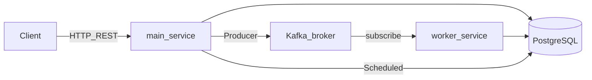

# План реализации лабораторной №3 (гранулярно)

Рабочая копия плана **в репозитории** (коммитьте изменения здесь). Дублирует логику Cursor-плана `lab3_kafka_worker_plan_*.plan.md`.

**Краткий обзор:** сначала убрать WildFly (JAR + embedded Tomcat + JDBC как в профиле `dev`). Затем разбить на `main-service` и `worker-service` **без** модуля `common` (дублирование минимального JPA в worker). БД — та же, что в [`src/main/resources/application-dev.yaml`](src/main/resources/application-dev.yaml). В Docker минимум **ZooKeeper + Kafka**. Прецеденты: Kafka (publish → модерация), `@Scheduled` (автоархив).

**Чеклист задач (порядок):**

- [x] **L первой:** JAR, embedded Tomcat, datasource из `dev` / env, убрать JNDI и `JBossAppServerJtaPlatform`; `bootRun` с dev БД
- [x] **A:** согласовано — см. [`docs/LAB3_STAGE2_TEACHER_CHECKLIST.md`](docs/LAB3_STAGE2_TEACHER_CHECKLIST.md): **явный `KafkaProducer`**, без упрощённого publish; остальное как в плане
- [x] **B:** `settings.gradle.kts`, `main-service` + `worker-service` JAR, без `common` — копии entity/repo/enum в worker
- [x] **C:** `VacancyStatus` + Flyway V6 CHECK + правила для `SUBMISSION_PENDING` + репозиторий для архивации
- [x] **D (инфра):** [`docker-compose.yml`](docker-compose.yml) — ZK + Kafka + init топика `vacancy.submitted-for-moderation`; в `application-dev` обоих модулей — `spring.kafka.bootstrap-servers` (дефолт `localhost:9092`). Опционально позже: `KafkaAdmin` / `NewTopic` в Java (дублирование create — безвредно)
- [x] **E:** Producer, DTO, `publishVacancy`, AFTER_COMMIT, контроллер 202, ошибки send
- [x] **F:** `@KafkaListener`, идемпотентность, `SUBMISSION_PENDING` → `PENDING_MODERATION`
- [x] **G:** `@EnableScheduling`, cron, архив `PUBLISHED` по `publishedAt` + `durationDays`
- [ ] **H:** pending-фильтры, запрет модерации `SUBMISSION_PENDING`, OpenAPI
- [ ] **I:** `docs/openapi.yaml`, BPMN, `scripts/`, deployment diagram
- [ ] **J:** ручной прогон, опционально Testcontainers, два реплики worker
- [ ] **K:** JCA/EIS по README — после ядра

---

Опора на код: [`VacancyService.publishVacancy`](main-service/src/main/kotlin/com/arekalov/blps/service/VacancyService.kt), [`VacancyController`](main-service/src/main/kotlin/com/arekalov/blps/controller/VacancyController.kt), [`VacancyStatus`](main-service/src/main/kotlin/com/arekalov/blps/model/enum/VacancyStatus.kt), Flyway [`V3__...`](main-service/src/main/resources/db/migration/V3__fix_vacancies_status_check_constraint.sql), [`Tariff.durationDays`](main-service/src/main/kotlin/com/arekalov/blps/model/Tariff.kt). Концепция: [`docs/LAB3_IMPLEMENTATION_PLAN.md`](docs/LAB3_IMPLEMENTATION_PLAN.md).

**Порядок фаз:** (1) **L** — выход с WildFly, БД как в **`dev`** (секреты → env, не в git). (2) **B** — multi-module без `common`. (3) **C–J**. Модуль **`common` не использовать**.

---

## Фаза A. Согласования и инварианты (выполнено)

Итог в [`docs/LAB3_STAGE2_TEACHER_CHECKLIST.md`](docs/LAB3_STAGE2_TEACHER_CHECKLIST.md):

- **Промежуточный статус** + **202** на publish; **одна БД**; без упрощённого сценария publish.
- **Формула архивации:** `publishedAt + durationDays` (как в плане), сверка с [`ModerationService.approveVacancy`](main-service/src/main/kotlin/com/arekalov/blps/service/ModerationService.kt).
- **Producer:** в коде — **явный** `KafkaProducer` + `ProducerRecord`.
- **WildFly:** JAR (фаза L) согласован в рамках чеклиста.

---

## Фаза B. Структура репозитория и сборка (после L)

1. **Gradle multi-project**: [`settings.gradle.kts`](settings.gradle.kts) — только `include("main-service", "worker-service")`. **Общего модуля `common` нет.**
2. **Перенос в `main-service/`**: уже «разwildflyенный» код из корня; `war` не возвращать. Корень — агрегатор Gradle.
3. **`worker-service`**: Spring Boot JAR, `data-jpa`, `postgresql`, `spring-kafka`; при необходимости `actuator`. **Дублирование:** entity, enum статусов, `VacancyRepository` (+ кастомные методы), конфиг JPA.
4. **БД worker:** те же `spring.datasource.*`, что и у main — профиль **`dev`** или те же env. Локальный Postgres в compose **не обязателен**.

---

## Фаза C. База данных и домен

5. **`VacancyStatus.SUBMISSION_PENDING`** (имя согласовать).
6. **Flyway `V6__...sql`** — расширить `vacancies_status_check` (как в [`V3`](src/main/resources/db/migration/V3__fix_vacancies_status_check_constraint.sql)).
7. **[`Vacancy`](src/main/kotlin/com/arekalov/blps/model/Vacancy.kt)** — enum mapping.
8. **Правила** для `SUBMISSION_PENDING` в [`VacancyService`](src/main/kotlin/com/arekalov/blps/service/VacancyService.kt).
9. **Репозиторий** — запросы для планировщика архивации; `@Modifying` при необходимости.

---

## Фаза D. Kafka инфраструктура

10. **`docker-compose.yml`**: **`zookeeper` + `kafka`**. Postgres опционален. `localhost:9092` для приложений на хосте.
11. **Топик** `vacancy.submitted-for-moderation` — `KafkaAdmin` / `NewTopic` или init в compose.
12. **Конфиг main:** `spring.kafka.bootstrap-servers`, producer acks/retries, идемпотентность при необходимости.

---

## Фаза E. Main-service: асинхронная отправка на модерацию

13. Зависимости: **`kafka-clients`** (обязательно для `KafkaProducer`); `spring-kafka` опционально только для админа/инфраструктуры при необходимости.
14. DTO события (JSON): `eventId`, `vacancyId`, `employerId?`, `occurredAt`, `schemaVersion`.
15. Бин продюсера: `KafkaProducer` + `ProducerRecord`, `@PreDestroy`.
16. **`publishVacancy`:** статус **`SUBMISSION_PENDING`**, затем событие после commit.
17. **`@TransactionalEventListener(AFTER_COMMIT)`** или outbox.
18. **[`VacancyController`](src/main/kotlin/com/arekalov/blps/controller/VacancyController.kt):** **202** + тело.
19. Ошибки Kafka после commit — минимум логирование.

---

## Фаза F. Worker-service: консьюмер

20. `@EnableKafka`, `ConsumerFactory` / listener container, `group.id`.
21. `@KafkaListener` — идемпотентность.
22. `@Transactional`, при необходимости `@Lock(PESSIMISTIC_WRITE)`.
23. `SUBMISSION_PENDING` → `PENDING_MODERATION`.
24. Логи: `eventId`, `vacancyId`, instance.

---

## Фаза G. Планировщик (main-service)

25. `@EnableScheduling`.
26. `VacancyArchivingScheduler`, cron `0 0 3 * * *` (или из конфига).
27–29. Запрос `PUBLISHED` по сроку, перевод в `ARCHIVED`, идемпотентный SQL.

---

## Фаза H. Модерация и OpenAPI

30–32. Pending только `PENDING_MODERATION`; запрет approve/reject для `SUBMISSION_PENDING`; OpenAPI.

---

## Фаза I. Документация

33–36. [`docs/openapi.yaml`](docs/openapi.yaml), BPMN, [`scripts/`](scripts/), deployment diagram.

---

## Фаза J. Тестирование

37. `docker compose up` (Kafka+ZK) → main + worker с `SPRING_PROFILES_ACTIVE=dev` → publish → worker → `PENDING_MODERATION`.
38–39. Опционально Testcontainers; две реплики worker.

---

## Фаза K. JCA

40. По [`README.md`](README.md) — после ядра.

---

## Фаза L. Уход с WildFly (первым шагом реализации)

41. Удалить `war` / `providedRuntime(tomcat)`; **`spring-boot-starter-web`**.
42. Убрать `jndi-name` из [`application.yaml`](src/main/resources/application.yaml); источник данных — профиль **`dev`** в [`application-dev.yaml`](src/main/resources/application-dev.yaml); секреты → `${ENV}`, `.env.example`.
43. Убрать `JBossAppServerJtaPlatform`; resource-local `@Transactional`.
44. JAAS/Spring Security без WF-specific realm — проверить сценарии.
45. Деплой: JAR / образ, порт 8080.
46. JCA (фаза K): при выборе RA — возможен снова сервер приложений.

---

## Риски

- Согласование лабы 2 vs JAR без WildFly.
- Дубли JPA в worker — править два места.
- Dev БД в облаке — два пула соединений; не коммитить пароли.
